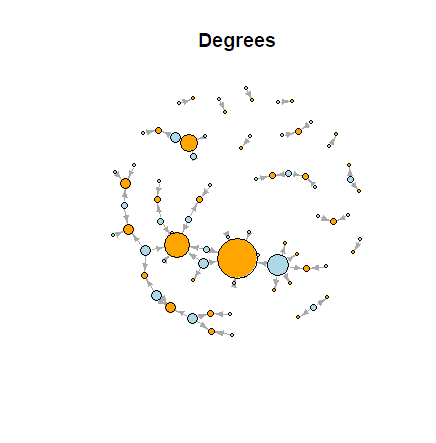
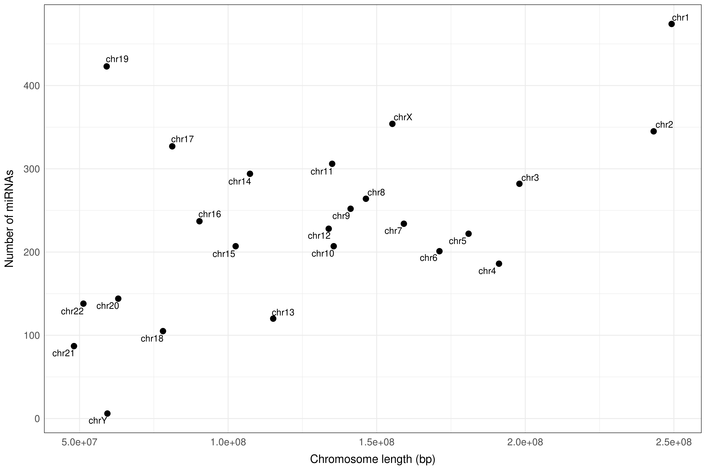
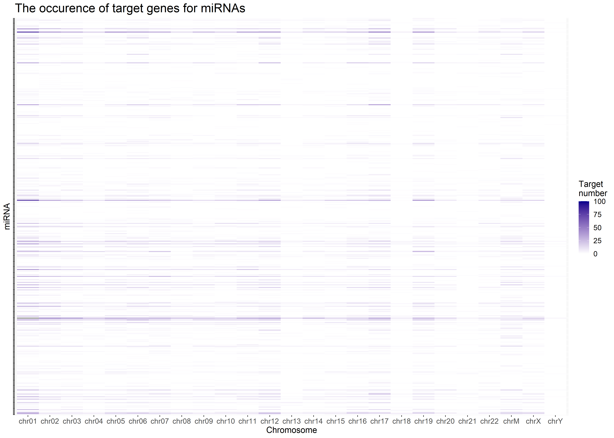

<style>
div.footnotes {
  position: absolute;
  bottom: 0;
  margin-bottom: 10px;
  width: 80%;
  font-size: 0.6em;
}
</style>

<script src="https://ajax.googleapis.com/ajax/libs/jquery/3.1.1/jquery.min.js"></script>
<script>
$(document).ready(function() {
  $('slide:not(.backdrop):not(.title-slide)').append('<div class=\"footnotes\">');

  $('footnote').each(function(index) {
    var text  = $(this).html();
    var fnNum = (index+1).toString();
    $(this).html(fnNum.sup());

    var footnote   = fnNum + '. ' + text + '<br/>';
    var oldContent = $(this).parents('slide').children('div.footnotes').html();
    var newContent = oldContent + footnote;
    $(this).parents('slide').children('div.footnotes').html(newContent);
  });
});
</script>


## Questions to answer

- What are the specificities of the miRNA - target interaction network? How can be it modelled using networks? - Luca
- Does the chromosomal localization of the target gene affect its miRNA regulation? - Sophie
- What is the connection between the function of the regulated target genes and the miRNAs regulating them? - Ági
- How does the distance between the miRNA gene and the target gene affect their regulation? - Benedek


## Introduction - miRNAs
```{r, out.width = "600px", echo=FALSE, fig.align="center"}
knitr::include_graphics("../docs/miRNA_schematic.gif")
```


## Dataset

- Human miRNA - target interaction database<footnote>Plotnikova, Olga, Ancha Baranova, and Mikhail Skoblov. "Comprehensive Analysis of Human microRNA–mRNA Interactome" Frontiers in Genetics 10 (2019):933. https://doi.org/10.3389/fgene.2019.00933 </footnote> downloaded from Exp-miBR (in `.tsv` format): experimentally confirmed miRNA binding regions and their features included too 
- Column names: `CHROM`, `start_Ref38`, `end_Ref38`, `length`, `STRAND`, `NDATASET`, `DATASET`, `NLINES`, `LINES`, `MIRNA`, `REGION`, `GENES`
- 46,740 rows, many `NA` values, miRNA IDs and target gene IDs often in one row, separated by commas

## Visualize the network
   
- The interactors (gene/miRNA) are represented by __nodes__ and their connections by __edges__
- Our network is __directed__, meaning the connections can only happen one was and not vice versa
- Using the igraph package you can visualize networks and customize its visual attributes

```{r, out.width = "500px", echo=FALSE, fig.align="center"}

```

```{r, echo=FALSE, eval=FALSE}
# Load libraries ----
library("tidyverse")
library("data.table")
library("igraph")

# Read data ----
network_raw <- read_tsv("../data/Exp-miBRS_track_information_hg38.tsv")

# Functions from Benedek----
create_pairs_1 <- function(x){
  mirnas <- strsplit(x[1], ",") %>% 
    `[[`(1)
  target_gene <- x[2]
  df <- data.frame(mirnas=mirnas,
                   target_gene=rep(target_gene, length(mirnas)))
  return(df)
}

create_pairs_2 <- function(x){
  genes <- strsplit(x[1], ",") %>% 
    `[[`(1)
  mirna <- x[2]
  df <- data.frame(target_gene=genes,
                   mirna=rep(mirna, length(genes)))
  return(df)
}

# Process data ----
# Select the miRNA(s) and target gene(s) interactions only exonic:
network_raw <- network_raw[network_raw$REGION == 'exonic', ] 

int_data <- network_raw %>% 
  dplyr::select(c(MIRNA, GENES)) %>% 
  filter(!is.na(MIRNA))

# Process data, to have single, pairwise target gene - miRNA interactions:
int_df <- apply(int_data, 1, create_pairs_1)  
int_df <- do.call("rbind", int_df) %>% 
  dplyr::select(target_gene, mirnas)
int_df <- apply(int_df, 1, create_pairs_2)  
int_df <- do.call("rbind", int_df)

# Remove NA values that were in a list 
int_df[ int_df == "NA" ] <- NA
int_df <- int_df %>% drop_na()

# Select onmy first 50 interactions for visualization purposes
int_df <- int_df[1:70,]

# Separate nodes
target_gene <- int_df %>%
  distinct(target_gene) %>%
  rename(label = target_gene)

source_mirna <- int_df %>%
  distinct(mirna) %>%
  rename(label = mirna)

node_df <- full_join(source_mirna, target_gene, by = "label")

# Change direction 
int_df <- int_df[,c(2, 1)]

# Create an igraph object
net <- graph.data.frame(int_df[1:70,], directed=T)

calc_network_stats <- function(network){
  # Calculate network density
  # The proportion of present edges from all possible edges in the network.
  density_res <- edge_density(network, loops=F)
  
  # Calculate transitivity
  transitivity_res <- triad_census(network)
  
  # Calculate degree (both in and out)
  degree_res <- degree(network, mode="all")
  # Add it to a data frame
  degree_res2 <- data.frame(degree=sort(degree_res, decreasing=TRUE)) %>% tibble::rownames_to_column()
  nodes_2 <- left_join(node_df, degree_res2, by = c("label"="rowname"))
  
  # Calculate betweenness centrality
  # centrality based on a broker position connecting others
  betweenness_res <- betweenness(network, v = V(network), directed = FALSE, weights = NULL,
                                 nobigint = TRUE, normalized = FALSE)
  # Add it to a data frame
  betweenness_res2 <- data.frame(betweenness_centrality=sort(betweenness_res, decreasing=TRUE)) %>% tibble::rownames_to_column()
  nodes_3 <- left_join(nodes_2, betweenness_res2, by = c("label"="rowname"))
  
  # Calculate hub score
  hub_res <- hub_score(network, scale = TRUE, weights = NULL,
                       options = arpack_defaults)
  # Add it to a data frame
  hub_res2 <- data.frame(hub_score=sort(hub_res$vector, decreasing=TRUE)) %>% tibble::rownames_to_column()
  nodes_4 <- left_join(nodes_3, hub_res2, by = c("label"="rowname"))
  
  return (nodes_4)
}

nodes_stat_df <- calc_network_stats(net)

# Set color to be blue for miRNAs
nodes_stat_df$color <- ifelse(grepl("hsa", nodes_stat_df$label), "lightblue", "orange")

# this ensures the starting random position is the same
# for the layouts that use a random starting position
set.seed(1492) 

l <- layout_with_fr(net)

l <- norm_coords(l, ymin=-1, ymax=1, xmin=-1, xmax=1)

# Plot node sizes according to node degree
plot(net, rescale=F, layout=l*1.0,
       edge.arrow.size=0.5, 
       vertex.label=NA,
       vertex.shape="circle", 
       vertex.size=nodes_stat_df$degree*3, 
       vertex.label.color="black", 
       edge.width=0.5,
       vertex.color= nodes_stat_df$color,
       main = 'Degrees')
```

```{r, echo=FALSE, eval=FALSE}
# Plot node sizes according to hubness
plot(net, rescale=F, layout=l*1.0,
       edge.arrow.size=0.5, 
       vertex.label=NA,
       vertex.shape="circle", 
       vertex.size=nodes_stat_df$hub_score*10, 
       vertex.label.color="black", 
       edge.width=0.5,
       vertex.color= nodes_stat_df$color,
       main = 'Hubs')
 ```
 
## Cytoscape visualization with RCy3
```{r, eval=FALSE}
library("RCy3")

# Run visualisation if cytoscape is open
if(continue){
  createNetworkFromDataFrames(nodes2, edges=net2[,1:2], title="exonic network")
  edges <- net2 %>%
    mutate(key=paste(source, "(interacts with)", target))
  print(edges)
  loadTableData(edges[,3:4], data.key.column = 'key', table = 'edge')
  
  # Colour by Betweenness centrality if data exists in network
  if (bet){
    setNodeColorMapping("betweenness_centrality",mapping.type="c", network="exonic network")
  }
  
  # Save cys file
  saveSession(filename = file.path("output/exonic_network.cys"))
}
 ```
## Cytoscape visualization with RCy3
```{r, out.width = "850px", echo=FALSE, fig.align="center"}
knitr::include_graphics("../docs/project_cytoscape_figure.png")
```

## Working with networks/graphs - igraph library

```{r, eval=FALSE}
library("igraph")

# Create graph object from edge list:
mirna_graph <- graph_from_edgelist(as.matrix(mirna_target_data[,1:2]), 
                                   directed = F)

# Generate random graph with the same properties:
random_graph <- sample_gnm(n=length(c(mirna_target_data$MIRNA,   # number of vertices
                                      mirna_target_data$GENES)), 
                           m = nrow(mirna_target_data))          # number of edges

# Get the degree distribution data:
random_degree_dist <- data.frame(k=as.numeric(degree(random_graph))) %>% 
  group_by(k) %>%                 # edge number
  summarize(freq=n()) %>% 
  filter(k!=0) %>% 
  mutate(freq=freq/sum(freq)) %>% # calculate frequency (0-1)
  as.data.frame() 

mirna_degree_dist <- mirna_target_data %>% 
  group_by(MIRNA) %>% 
  summarize(k=n()) %>% 
  group_by(k) %>% 
  summarize(freq=n()) %>% 
  mutate(freq=freq/sum(freq)) %>% 
  as.data.frame()
```

## Visualize degree distribution - Plot

```{r, out.width = "900px", echo=FALSE, fig.align="center"}
knitr::include_graphics("../docs/degree_dist.png")
```

## Chromosome length versus number of miRNAs - Arrange text annotation automatically

```{r, eval=FALSE}
# Plot the length of the chromosome vs. number of miRNAs:
cor_plot <- ggplot(chr_info, aes(x=V2, y=count,label = V1))+
  geom_point(size=3)+
  ### <b>
  ggrepel::geom_text_repel()+
  ### </b>
  theme_minimal() +
  theme(panel.border = element_rect(color = "black", fill = NA),
        axis.text.x = element_text(size=12, hjust = 0.5, vjust = 0.5, angle=0),
        axis.title.x = element_text(size = 14, margin = margin(t = 10, r = 0, b = 0, l = 0)),
        axis.title.y = element_text(size = 14, margin = margin(t = 0, r = 10, b = 0, l = 0)),
        axis.text.y = element_text(size = 12),
        legend.position="none")+
  xlab("Chromosome length (bp)")+
  ylab("Number of miRNAs")
```

## Chromosome length versus number of miRNAs plot

```{r, out.width = "700px", echo=FALSE, fig.align="center"}

```

## Randomization and heatmap
1. data cleaning
2. randomizing the target gene chromosome localizations
3. calculating the occurance
```{r, echo=FALSE,eval=FALSE}
# Libraries ----

        library(tidyverse)
        # library("ComplexHeatmap")

# Data cleaning ----

        setwd("~/R")
        raw_data <- read.table("Exp-miBRS_track_information_hg38.tsv",header = TRUE) # Loading the source table, column names from the first row
        miRNA_data <- subset(raw_data,subset=!is.na(MIRNA)) # Deleting NA rows
        miRNA_data_min <- miRNA_data[,c(1,10,12)] # Deleting useless information
        miRNA_data_min[miRNA_data_min=="chr1"] <- "chr01" #renaming the chromosomes for later ordering
        miRNA_data_min[miRNA_data_min=="chr2"] <- "chr02"
        miRNA_data_min[miRNA_data_min=="chr3"] <- "chr03"
        miRNA_data_min[miRNA_data_min=="chr4"] <- "chr04"
        miRNA_data_min[miRNA_data_min=="chr5"] <- "chr05"
        miRNA_data_min[miRNA_data_min=="chr6"] <- "chr06"
        miRNA_data_min[miRNA_data_min=="chr7"] <- "chr07"
        miRNA_data_min[miRNA_data_min=="chr8"] <- "chr08"
        miRNA_data_min[miRNA_data_min=="chr9"] <- "chr09"
        miRNA_data_3 <- separate_rows(miRNA_data_min,MIRNA,sep=",") # Separating the miRNAs to rows for each regulated gene
        miRNA_data_4 <- subset(miRNA_data_3,subset=MIRNA!="NA") # Deleting NA rows

# Randomizing ----

        miRNA_data_randomized <- miRNA_data_4 # Loading the original data to randomize
        miRNA_data_randomized$CHROM <- sample(unique(miRNA_data_4$CHROM),
                                              size=nrow(miRNA_data_4),
                                              replace=TRUE) # Randomizing the target gene's location
        # miRNA_data_randomized$GENES <- sample(miRNA_data_4$GENES,
        #                                       size=nrow(miRNA_data_4),
        #                                       replace=FALSE) # Randomizing the target gene

# original
```
```{r, eval=FALSE}
        (occurence <- (table(miRNA_data_4$MIRNA,miRNA_data_4$CHROM)))
```
```{r, out.width = "900px", echo=FALSE, fig.align="center"}

```
```{r, echo=FALSE, eval=FALSE}
        (occurence <- (table(miRNA_data_4$MIRNA,miRNA_data_4$CHROM)))
        occurence_df <- as.data.frame(table(miRNA_data_4$MIRNA,miRNA_data_4$CHROM))
        occurence_df <- arrange(occurence_df,Var1)
        occurence_df %>% 
                group_by(Var1) %>% 
                summarize(Var1,Var2,sum=sum(Freq),max=max(Freq),percent=(Freq)/sum(Freq))
        occ_percent <- occurence_df %>% 
                group_by(Var1) %>% 
                summarize(Var1,Var2,sum=sum(Freq),max=max(Freq),percent=(Freq)/sum(Freq))
        target100 <- occ_percent %>% 
                group_by(Var1) %>% 
                filter(sum>100) %>% 
                summarise(Var1,Var2,percent)

# random
        (occurence_random <- (table(miRNA_data_randomized$MIRNA,miRNA_data_randomized$CHROM)))
        occurence_random_df <- as.data.frame(table(miRNA_data_randomized$MIRNA,miRNA_data_randomized$CHROM))
        occurence_random_df <- arrange(occurence_random_df,Var1)
        occurence_random_df %>% 
                group_by(Var1) %>% 
                summarize(Var1,Var2,sum=sum(Freq),max=max(Freq),percent=(Freq)/sum(Freq))
        occ_rand_percent <- occurence_random_df %>% 
                group_by(Var1) %>% 
                summarize(Var1,Var2,sum=sum(Freq),max=max(Freq),percent=(Freq)/sum(Freq))
        target100_rand <- occ_rand_percent %>% 
                group_by(Var1) %>% 
                filter(sum>100) %>% 
                summarise(Var1,Var2,percent)
```

## Randomization and heatmap

1. data cleaning
2. randomizing the target gene chromosome localizations
3. calculating the occurance
4. visualizing the results using heatmap
```{r, eval=FALSE}
# original 1. plot
        png("original1.png", width = 700, height = 700)
        heatmap(occurence[,],
                scale="row",
                Rowv=TRUE,Colv=NA,
                xlab="Chromosome",ylab="miRNA",
                main="The number of miRNA target genes in each chromosome",
                margins=c(4,8))
        dev.off()
```

## Randomization and heatmap

1. data cleaning
2. randomizing the target gene chromosome localizations
3. calculating the occurance
4. visualizing the results using heatmap or ggplot
```{r, eval=FALSE}
# original 2. plot
        original2 <- ggplot(occurence_df[,],aes(Var2,Var1,fill=Freq))+
                labs(x="Chromosome",
                     y="miRNA",
                     title="The occurence of target genes for miRNAs")+
                geom_tile()+
                theme(axis.title.x = element_text(size = 14),
                      axis.text.x = element_text(size = 12),
                      axis.title.y = element_text(size = 14),
                      axis.text.y = element_blank(),
                      legend.title = element_text(size = 14),
                      legend.text = element_text(size = 12),
                      plot.title = element_text(size = 20))+
                scale_fill_gradient(name="Target \nnumber",
                                    low="white", high="darkblue",
                                    limits=c(0,100))
        ggsave("C:/Users/Lenovo/Documents/R/original2.png",
               original2, units = "in", width = 14, height = 10)
```
```{r, eval=FALSE}
# original 3. plot
        original3 <- ggplot(target100,aes(Var2,Var1,fill=percent))+
                labs(x="Chromosome",
                     y="miRNA",
                     title="The occurence of target genes for miRNAs, \nwhich have more than 100 targets")+
                geom_tile()+
                theme(axis.title.x = element_text(size = 14),
                      axis.text.x = element_text(size = 12),
                      axis.title.y = element_text(size = 14),
                      axis.text.y = element_text(size = 12),
                      legend.title = element_text(size = 14),
                      legend.text = element_text(size = 12),
                      plot.title = element_text(size = 20))+
                scale_fill_gradient(name="Target \nfrequency",
                                    low="white", high="darkblue",
                                    limits=c(0,0.2))
        ggsave("C:/Users/Lenovo/Documents/R/original3.png",
               original3, units = "in", width = 15, height = 10)

# random 1. plot
        png("random1.png", width = 700, height = 700)
        heatmap(occurence_random[],
                scale="row",
                Rowv=TRUE,Colv=NA,
                xlab="Chromosome",ylab="miRNA",
                main="The number of miRNA target genes in each chromosome \n after randomization",
                margins=c(4,8))
        # Heatmap(occurence_random[],
        #         name="The",
        #         cluster_columns = FALSE,
        #         clustering_method_rows ="complete",
        #         show_row_names = FALSE,
        #         row_title="miRNA",row_title_gp=gpar(fontsize = 14),
        #         column_title="Chromosome",column_title_gp=gpar(fontsize = 14))
        dev.off()

# random 2. plot
        random2 <- ggplot(occurence_random_df[,],aes(Var2,Var1,fill=Freq))+
                labs(x="Chromosome",
                     y="miRNA",
                     title="After randomization, the occurence of target genes for miRNAs")+
                geom_tile()+
                theme(axis.title.x = element_text(size = 14),
                      axis.text.x = element_text(size = 12),
                      axis.title.y = element_text(size = 14),
                      axis.text.y = element_blank(),
                      legend.title = element_text(size = 14),
                      legend.text = element_text(size = 12),
                      plot.title = element_text(size = 20))+
                scale_fill_gradient(name="Target \nnumber",
                                    low="white", high="darkblue",
                                    limits=c(0,100))
        ggsave("C:/Users/Lenovo/Documents/R/random2.png",
               random2, units = "in", width = 14, height = 10)

# random 3. plot
        random3 <- ggplot(target100_rand,aes(Var2,Var1,fill=percent))+
                labs(x="Chromosome",
                     y="miRNA",
                     title="After randomization, the occurence of target genes for miRNAs, \nwhich have more than 100 targets")+
                geom_tile()+
                theme(axis.title.x = element_text(size = 14),
                      axis.text.x = element_text(size = 12),
                      axis.title.y = element_text(size = 14),
                      axis.text.y = element_text(size = 12),
                      legend.title = element_text(size = 14),
                      legend.text = element_text(size = 12),
                      plot.title = element_text(size = 20))+
                scale_fill_gradient(name="Target \nfrequency",
                                    low="white", high="darkblue",
                                    limits=c(0,0.2))
        ggsave("C:/Users/Lenovo/Documents/R/random3.png",
               random3, units = "in", width = 15, height = 10)
```

## Original 1. plot
```{r, out.width = "570px", echo=FALSE, fig.align="center"}

```

## Random 1. plot
```{r, out.width = "570px", echo=FALSE, fig.align="center"}

```

## Original 2. plot
```{r, out.width = "700px", echo=FALSE, fig.align="center"}

```

## Random 2. plot
```{r, out.width = "700px", echo=FALSE, fig.align="center"}

```

## Original 3. plot
```{r, out.width = "800px", echo=FALSE, fig.align="center"}

```

## Random 3. plot
```{r, out.width = "800px", echo=FALSE, fig.align="center"}

```
   
## GO Terms analysis

- Retrieving the gene ontology information of the genes based on ensemble gene identifiers
- biomaRt package
```{r,eval=FALSE}
###################################################################################
#               A GO Term analyses using the biomaRt package
###################################################################################

library("biomaRt")
library("GO.db")
setwd("D:/University/4_SEMESTER/R_advanced/miRNA_project")

# Load the data: -----
mirnas <- read.table("D:/University/4_SEMESTER/R_advanced/miRNA_project/mirna_targetgene_pairs.tsv", header = TRUE)
head(mirnas)

# data cleaning is needed to remove the NA values: ----
gene_ids <- na.omit(gene_ids)
head(gene_ids)

listMarts()
listDatasets(ensembl) # "hsapiens_gene_ensembl" 
listDatasets(ensembl)$dataset # just ..._gene_ensembl datasets printed out
```

## GO Terms analysis

```{r,eval=FALSE}

# Choosing the ensembl mart and homo sapiens dataset:
ensembl = useMart("ensembl",dataset="hsapiens_gene_ensembl")
# Searching for filters (for the query which will be built)
filters = listFilters(ensembl)
head(filters)
# Check all the attributes to find those what can be important for now:
attributes = listAttributes(ensembl)
# Selected attributes:
# ensembl_gene_id - Gene stable ID
# chromosome_name - Chromosome/scaffold name
# external_gene_name - Gene name
# transcript_count - Transcript count
# go_id - GO term accession
# name_1006 - GO term name

# Query on all the gene ids: 
GO_Terms <- getBM(attributes = c("ensembl_gene_id", "name_1006", "go_id",
                                 "external_gene_name", "transcript_count", "chromosome_name"),
                                filters = "ensembl_gene_id", values = gene_ids, mart = ensembl)

GO_Terms <- as.data.frame(GO_Terms)
write.table(GO_Terms, file = "GO_terms_output_2.csv", sep = "\t")
```

## Distribution of molecular functions on the chromosomes

- How are the molecular functions distributed on the chromosomes?
```{r, eval=FALSE}
library(tidyverse)
library(dplyr)
library(ggplot2)

GO_Terms <- read.table("D:/University/4_SEMESTER/R_advanced/miRNA_project/GO_terms_output_2.csv", header = TRUE)
head(GO_Terms)
filter_go_terms <- c("GO:0042632", "GO:0045727", "GO:0035195", "GO:0043410", "GO:0030336", "GO:0032869")
filtered_go_terms <- GO_Terms %>% filter(go_id %in% filter_go_terms)
head(filtered_go_terms)
chr_occurrences_df <- as.data.frame(table(filtered_go_terms$go_id, filtered_go_terms$chromosome_name))
chr_occurrences_df

selected_genes_plot <- ggplot(chr_occurrences_df, aes(x = Var2, y = Freq, fill = Var1))+
  geom_col()+
  theme_light()+
  labs(x = "Chromosomes",
       y = "Number of occurences of the function's genes on the crhomosomes",
       title = "Distribution of molecular functions on the chromosomes")
selected_genes_plot
ggsave("D:/University/4_SEMESTER/R_advanced/miRNA_project/selected_genes_loc.png", selected_genes_plot, units = 'in', width = 8)

```

## Distribution of molecular functions on the chromosomes 
Selected GO identifiers:
GO:0042632 - 	cholesterol homeostasis - general, 
GO:0045727 - positive regulation of translation - general, 
GO:0035195 - gene silencing by miRNA - the most general from the selected functions, 
GO:0043410 - positive regulation of MAPK cascade  - rare (it is only has 4 genes), 
GO:0030336 - negative regulation of cell migration  - general, 
GO:0032869 - cellular response to insulin stimulus - rare

Note: 1 GO id can connect to more than one gene

```{r, out.width = "400px", echo=FALSE, fig.align="center"}
knitr::include_graphics("../docs/selected_genes_loc.png")
```
```{r, eval=FALSE}
   colnames(mirnas)[4] <- "ensembl_gene_id"
good_merged_table <- merge(GO_Terms,mirnas,by="ensembl_gene_id")
mirna_occurrences_df <- as.data.frame(table(good_merged_table$go_id, good_merged_table$mirna))
mirna_occ_filtered <- mirna_occurrences_df %>%
  filter((Freq)>0) %>% 
  filter(Var1!="")

ggplot(mirna_occ_filtered, aes(x = Var2, y = Freq, fill = Var1))+
  geom_col()+
  theme_light()+
  theme(legend.position = c(.95, .95),
        legend.justification = c("right", "top"),
        legend.box.just = "right",
        legend.margin = margin(6, 6, 6, 6))+
  labs(x = "miRNA",
       y = "Number of occurences of the function's genes on the crhomosomes",
       title = "Distribution of molecular functions on the chromosomes")
```

## miRNA goterm

```{r, out.width = "950px", echo=FALSE, fig.align="center"}

```
   
## Thank you for your kind attention!

## Rrrr group
