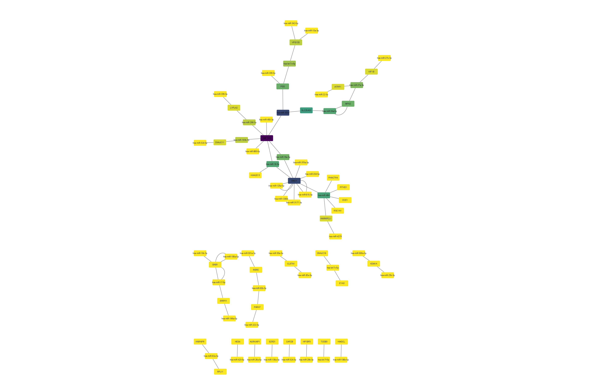
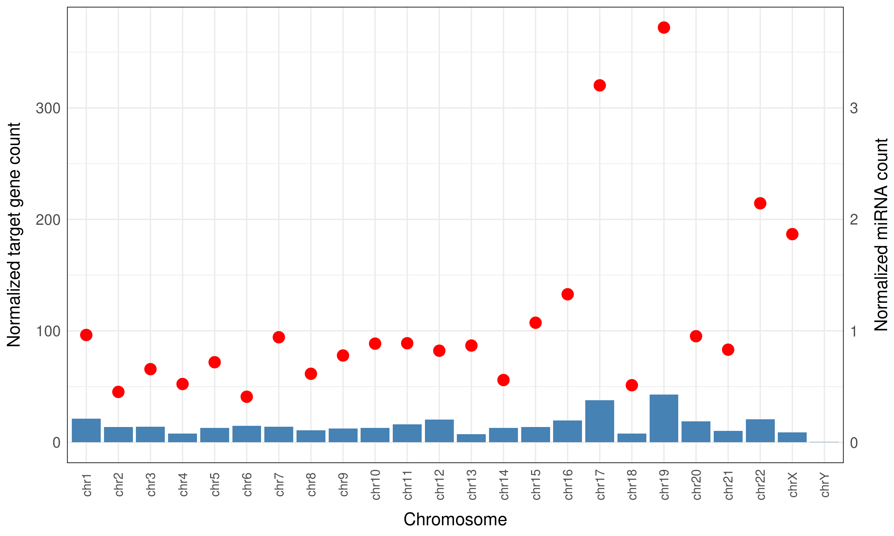

<style>
div.footnotes {
  position: absolute;
  bottom: 0;
  margin-bottom: 10px;
  width: 80%;
  font-size: 0.6em;
}
</style>

<script src="https://ajax.googleapis.com/ajax/libs/jquery/3.1.1/jquery.min.js"></script>
<script>
$(document).ready(function() {
  $('slide:not(.backdrop):not(.title-slide)').append('<div class=\"footnotes\">');

  $('footnote').each(function(index) {
    var text  = $(this).html();
    var fnNum = (index+1).toString();
    $(this).html(fnNum.sup());

    var footnote   = fnNum + '. ' + text + '<br/>';
    var oldContent = $(this).parents('slide').children('div.footnotes').html();
    var newContent = oldContent + footnote;
    $(this).parents('slide').children('div.footnotes').html(newContent);
  });
});
</script>


## Questions to answer

- How does the distance between the miRNA gene and the target's gene affects their regulation?
- What are the specificities of the miRNA - targets interaction network?

## Introduction - miRNAs
```{r, out.width = "600px", echo=FALSE, fig.align="center"}
knitr::include_graphics("../docs/miRNA_schematic.gif")
```


## Dataset

- Human miRNA - target interaction database<footnote>Plotnikova, Olga, Ancha Baranova, and Mikhail Skoblov. "Comprehensive Analysis of Human microRNA–mRNA Interactome" Frontiers in Genetics 10 (2019):933. https://doi.org/10.3389/fgene.2019.00933 </footnote> downloaded from Exp-miBR (in `.tsv` format): experimentally confirmed miRNA binding regions and their features included too 
- Column names: `CHROM`, `start_Ref38`, `end_Ref38`, `length`, `STRAND`, `NDATASET`, `DATASET`, `NLINES`, `LINES`, `MIRNA`, `REGION`, `GENES`
- 46,740 rows, many `NA` values, miRNA IDs and target gene IDs often in one row, separated by commas

## Visualize the network
   
- The interactors (gene/miRNA) are represented by __nodes__ and their connections by __edges__
- Our network is __directed__, meaning the connections can only happen one was and not vice versa
- Using the igraph package you can visualize networks and customize its visual attributes
   
## Igraph visualization

```{r, echo=FALSE}
# Load libraries ----
library("tidyverse")
library("data.table")
library("igraph")

# Read data ----
network_raw <- read_tsv("../data/Exp-miBRS_track_information_hg38.tsv")

# Functions from Benedek----
create_pairs_1 <- function(x){
  mirnas <- strsplit(x[1], ",") %>% 
    `[[`(1)
  target_gene <- x[2]
  df <- data.frame(mirnas=mirnas,
                   target_gene=rep(target_gene, length(mirnas)))
  return(df)
}

create_pairs_2 <- function(x){
  genes <- strsplit(x[1], ",") %>% 
    `[[`(1)
  mirna <- x[2]
  df <- data.frame(target_gene=genes,
                   mirna=rep(mirna, length(genes)))
  return(df)
}

# Process data ----
# Select the miRNA(s) and target gene(s) interactions only exonic:
network_raw <- network_raw[network_raw$REGION == 'exonic', ] 

int_data <- network_raw %>% 
  dplyr::select(c(MIRNA, GENES)) %>% 
  filter(!is.na(MIRNA))

# Process data, to have single, pairwise target gene - miRNA interactions:
int_df <- apply(int_data, 1, create_pairs_1)  
int_df <- do.call("rbind", int_df) %>% 
  dplyr::select(target_gene, mirnas)
int_df <- apply(int_df, 1, create_pairs_2)  
int_df <- do.call("rbind", int_df)

# Remove NA values that were in a list 
int_df[ int_df == "NA" ] <- NA
int_df <- int_df %>% drop_na()

# Select onmy first 50 interactions for visualization purposes
int_df <- int_df[1:70,]

# Separate nodes
target_gene <- int_df %>%
  distinct(target_gene) %>%
  rename(label = target_gene)

source_mirna <- int_df %>%
  distinct(mirna) %>%
  rename(label = mirna)

node_df <- full_join(source_mirna, target_gene, by = "label")

# Change direction 
int_df <- int_df[,c(2, 1)]

# Create an igraph object
net <- graph.data.frame(int_df[1:70,], directed=T)

calc_network_stats <- function(network){
  # Calculate network density
  # The proportion of present edges from all possible edges in the network.
  density_res <- edge_density(network, loops=F)
  
  # Calculate transitivity
  transitivity_res <- triad_census(network)
  
  # Calculate degree (both in and out)
  degree_res <- degree(network, mode="all")
  # Add it to a data frame
  degree_res2 <- data.frame(degree=sort(degree_res, decreasing=TRUE)) %>% tibble::rownames_to_column()
  nodes_2 <- left_join(node_df, degree_res2, by = c("label"="rowname"))
  
  # Calculate betweenness centrality
  # centrality based on a broker position connecting others
  betweenness_res <- betweenness(network, v = V(network), directed = FALSE, weights = NULL,
                                 nobigint = TRUE, normalized = FALSE)
  # Add it to a data frame
  betweenness_res2 <- data.frame(betweenness_centrality=sort(betweenness_res, decreasing=TRUE)) %>% tibble::rownames_to_column()
  nodes_3 <- left_join(nodes_2, betweenness_res2, by = c("label"="rowname"))
  
  # Calculate hub score
  hub_res <- hub_score(network, scale = TRUE, weights = NULL,
                       options = arpack_defaults)
  # Add it to a data frame
  hub_res2 <- data.frame(hub_score=sort(hub_res$vector, decreasing=TRUE)) %>% tibble::rownames_to_column()
  nodes_4 <- left_join(nodes_3, hub_res2, by = c("label"="rowname"))
  
  return (nodes_4)
}

nodes_stat_df <- calc_network_stats(net)

# Set color to be blue for miRNAs
nodes_stat_df$color <- ifelse(grepl("hsa", nodes_stat_df$label), "lightblue", "orange")

# this ensures the starting random position is the same
# for the layouts that use a random starting position
set.seed(1492) 

l <- layout_with_fr(net)

l <- norm_coords(l, ymin=-1, ymax=1, xmin=-1, xmax=1)

# Plot node sizes according to node degree
plot(net, rescale=F, layout=l*1.0,
       edge.arrow.size=0.5, 
       vertex.label=NA,
       vertex.shape="circle", 
       vertex.size=nodes_stat_df$degree*3, 
       vertex.label.color="black", 
       edge.width=0.5,
       vertex.color= nodes_stat_df$color,
       main = 'Degrees')
```

## Igraph visualization
```{r, echo=FALSE}
# Plot node sizes according to hubness
plot(net, rescale=F, layout=l*1.0,
       edge.arrow.size=0.5, 
       vertex.label=NA,
       vertex.shape="circle", 
       vertex.size=nodes_stat_df$hub_score*10, 
       vertex.label.color="black", 
       edge.width=0.5,
       vertex.color= nodes_stat_df$color,
       main = 'Hubs')
 ```
 
## Cytoscape visualization with RCy3
```{r, eval=FALSE}
library("RCy3")

# Run visualisation if cytoscape is open
if(continue){
  createNetworkFromDataFrames(nodes2, edges=net2[,1:2], title="exonic network")
  edges <- net2 %>%
    mutate(key=paste(source, "(interacts with)", target))
  print(edges)
  loadTableData(edges[,3:4], data.key.column = 'key', table = 'edge')
  
  # Colour by Betweenness centrality if data exists in network
  if (bet){
    setNodeColorMapping("betweenness_centrality",mapping.type="c", network="exonic network")
  }
  
  # Save cys file
  saveSession(filename = file.path("output/exonic_network.cys"))
}
 ```
## Cytoscape visualization with RCy3
```{r, out.width = "700px", echo=FALSE, fig.align="center"}

```
   
## Chromosome length versus number of miRNAs - Arrange text annotation automatically

```{r, eval=FALSE}
# Plot the length of the chromosome vs. number of miRNAs:
cor_plot <- ggplot(chr_info, aes(x=V2, y=count,label = V1))+
  geom_point(size=3)+
  ### <b>
  ggrepel::geom_text_repel()+
  ### </b>
  theme_minimal() +
  theme(panel.border = element_rect(color = "black", fill = NA),
        axis.text.x = element_text(size=12, hjust = 0.5, vjust = 0.5, angle=0),
        axis.title.x = element_text(size = 14, margin = margin(t = 10, r = 0, b = 0, l = 0)),
        axis.title.y = element_text(size = 14, margin = margin(t = 0, r = 10, b = 0, l = 0)),
        axis.text.y = element_text(size = 12),
        legend.position="none")+
  xlab("Chromosome length (bp)")+
  ylab("Number of miRNAs")
```

## Chromosome length versus number of miRNAs plot

```{r, out.width = "700px", echo=FALSE, fig.align="center"}
knitr::include_graphics("../docs/corr_plot.png")
```

## Working with networks/graphs - igraph library

```{r, eval=FALSE}
library("igraph")

# Create graph object from edge list:
mirna_graph <- graph_from_edgelist(as.matrix(mirna_target_data[,1:2]), 
                                   directed = F)

# Generate random graph with the same properties:
random_graph <- sample_gnm(n=length(c(mirna_target_data$MIRNA,   # number of vertices
                                      mirna_target_data$GENES)), 
                           m = nrow(mirna_target_data))          # number of edges

# Get the degree distribution data:
random_degree_dist <- data.frame(k=as.numeric(degree(random_graph))) %>% 
  group_by(k) %>%                 # edge number
  summarize(freq=n()) %>% 
  filter(k!=0) %>% 
  mutate(freq=freq/sum(freq)) %>% # calculate frequency (0-1)
  as.data.frame() 

mirna_degree_dist <- mirna_target_data %>% 
  group_by(MIRNA) %>% 
  summarize(k=n()) %>% 
  group_by(k) %>% 
  summarize(freq=n()) %>% 
  mutate(freq=freq/sum(freq)) %>% 
  as.data.frame()
```

## Visualize degree distribution - Plot

```{r, out.width = "900px", echo=FALSE, fig.align="center"}

```

## Barplot - Second Y axis

```{r, eval=FALSE}
library("patchwork")

barplot <- ggplot(plot1_data_interactions, 
                  aes(x=factor(target_chr, level=level_order), 
                      y=norm_count))+
  geom_bar(stat="identity", fill="steelblue")+
  geom_point(data=plot1_data_mirnacount, 
             aes(x=factor(mirna_chr),
                 y=norm_count),
             color="red",
             size=4)+
  annotate(geom="text", label=paste0("corr. = ", as.character(round(cor, 2))), 
           x="chrX", y=350)+
  ### <b>
  scale_y_continuous(name = "Normalized target gene count",
                     sec.axis = sec_axis(~./100, 
                                         name="Normalized miRNA count"))+
  ### </b>
  theme_minimal()+
  theme(panel.border = element_rect(color = "black", fill = NA),
        axis.text.x = element_text(size=10, hjust = 0.5, vjust = 0.5, angle=90),
        axis.title.x = element_text(size = 14, margin = margin(t = 10, r = 0, b = 0, l = 0)),
        axis.title.y = element_text(size = 14, margin = margin(t = 0, r = 10, b = 0, l = 0)),
        axis.text.y = element_text(size = 12),
        axis.title.y.right = element_text(size=14,
                                          angle=90,
                                          margin = margin(t = 0, r = 0, b = 0, l = 10)))+
  xlab("Chromosome")
```

## Number of miRNA genes and targets by chromosome - Plot

```{r, out.width = "700px", echo=FALSE, fig.align="center"}

```

- Normalized count = count/(chromosome length/10M)
